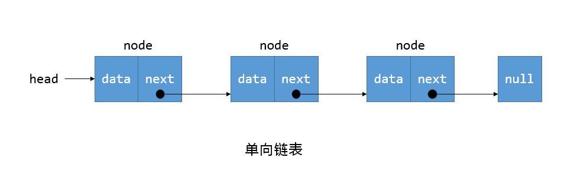

# Data-Structures-and-Algorithms-in-JavaScript

## 1. Data Structure

### 1.1 链表

单向链表

#### 1.1.1 链表常见操作

##### 1.1.1.1 增加

- append(data)：向链表尾部添加一个新的项

- insert(index, data)：在链表的特定位置插入一个新的项

##### 1.1.1.2 查询

- get(index)：获取对应位置的元素

- indexOf(data)：返回元素在链表中的索引。如果链表中没有该元素，返回-1

##### 1.1.1.3 更新

- update(index, data)：更新某个位置的元素

##### 1.1.1.4 删除

- removeAt(index)：从链表的特定位置移除一个项

- remove(data)：移除特定元素的那一项

##### 1.1.1.5 其他

- isEmpty()：检查链表是否为空

- size()：返回链表中元素的个数

- toString()：将链表中的元素拼接成字符串返回

## 2. Algorithms

### 2.1 Quick Sort 快速排序

`快速排序`是一种快速的排序算法，采用[分而治之]的思想，用于对列表元素进行排序。虽然排序是非常简单的概念，但是它却是使用于复杂程序中的最基础的原理，例如文件搜索、数据压缩、已经路径查找。选择排序算法时，运行时间是需要考虑的重要事项，因为效率通常是根据速度来衡量的。快速排序在最坏情况下的运行时间非常慢，但是在平均情况和最优情况下的运行时间都很快。

#### 2.1.1 排序

映射以下的输入/输出对的算法，被称为`排序算法`。

输入：数组 A，其中包含 n 个可排序的元素（整数、字符串、浮点数、等等）：A[0, 1, ..., n-1]。

输出：A 的已经排序好的排列，被称为 B，使得 B[0] ≤ B[1] ≤ ... ≤ B[n-1]。

#### 2.1.2 快速排序

#### 2.1.3 选取基准

#### 2.1.4 实现

#### 2.1.5 复杂度
